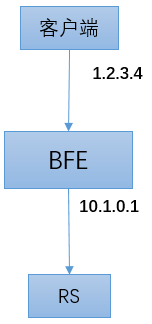

# 信息的透传

作为一个HTTP反向代理，BFE除了转发原始的HTTP请求之外，还会通过在HTTP Header中增加字段的方式向后端或用户传递一些额外的信息。

## 客户端IP地址的透传

### 需求来源

在经过BFE转发后，RS无法获得原始的客户端IP地址，而只能获得BFE实例的IP地址。

如下图所示，客户端的IP地址为1.2.3.4，在经过BFE转发后，BFE和RS建立了新的TCP连接，RS只能看到BFE的地址10.1.0.1。



很多应用都需要获取请求原始的IP地址。需要提供机制将原始的IP地址传递到RS。

### 透传方案

BFE在扩展模块mod_header中默认提供了捎带客户端IP地址和端口的功能。只要在BFE启动时配置加载mod_header，在转发后请求中就会包含这两个信息。

在经过BFE转发后，在请求头部会增加2个字段：

+ X-Real-Ip：用于传递原始的客户端IP地址
+ X-Real-Port：用于传递原始的客户端端口

有些人可能会考虑从“X-Forwarded-For”来获取客户端的IP地址。BFE使用独立定义的“X-Real-Ip”是为了避免“X-Forwarded-For”被伪造。如果请求在到达BFE时已经包含了“X-Real-Ip”字段，BFE会将这个字段的值重写为BFE所见的客户端IP地址，从而避免这个字段被伪造。

## 其它信息的透传

除了客户端的IP地址和端口外，mod_header也提供对请求中加入其它信息的能力。

### 租户配置表

在mod_header中，可以对每个租户提供一张配置表，每条配置包括：

+ 匹配的条件：使用“条件表达式”（见“[BFE的路由转发机制](../route/route.md)”）来描述

+ 执行的动作列表：在命中匹配条件后，可以执行1至多个动作

  可执行的动作见下面的介绍。

+ last：如果为true，则直接返回，不再匹配下面的规则

  和“转发表”（见“[BFE的路由转发机制](../route/route.md)”）中“只会命中一次”的机制不同，在mod_header中一个请求可能同时命中多条规则，并执行多条规则对应的动作。在希望继续匹配其它规则的时候，可以将last设置为false。


### 可能的动作

在mod_header中，对于请求和响应都可以执行设置、添加或删除操作。

在设置或添加的时候，需要提供头部字段的名称和取值。

| 动作名称       | 含义       | 参数列表说明            |
| -------------- | ---------- | ----------------------- |
| REQ_HEADER_SET | 设置请求头 | HeaderName, HeaderValue |
| REQ_HEADER_ADD | 添加请求头 | HeaderName, HeaderValue |
| REQ_HEADER_DEL | 删除请求头 | HeaderName              |
| REQ_HEADER_RENAME | 重命名请求头 | HeaderName, HeaderName2 |
| RSP_HEADER_SET | 设置响应头 | HeaderName, HeaderValue |
| RSP_HEADER_ADD | 添加响应头 | HeaderName, HeaderValue |
| RSP_HEADER_DEL | 删除响应头 | HeaderName              |
| REQ_HEADER_RENAME | 重命名响应头 | HeaderName, HeaderName2 |

### 例子

下面是mod_header配置的一个例子。

针对example_product这个租户，只配置了一条规则。如果命中规则，则顺序执行3个动作，对请求头做2次设置，对响应头做1次设置。

在请求头中透传信息时，用户可以根据自己的需要来设置头部字段的名称。

```
{
    "Version": "20190101000000",
    "Config": {
        "example_product": [
            {
                "cond": "req_path_prefix_in(\"/header\", false)",
                "actions": [
                    {
                        "cmd": "REQ_HEADER_SET",
                        "params": [
                            "X-Bfe-Log-Id",
                            "%bfe_log_id"
                        ]
                    },
                    {
                        "cmd": "REQ_HEADER_SET",
                        "params": [
                            "X-Bfe-Vip",
                            "%bfe_vip"
                        ]
                    },
                    {
                        "cmd": "RSP_HEADER_SET",
                        "params": [
                            "X-Proxied-By",
                            "bfe"
                        ]
                    }
                ],
                "last": true
            }
        ]
    }
}
```

### 内置变量

在上面的例子中，在设置"X-Bfe-Log-Id"和"X-Bfe-Vip"时，使用了内置的变量。在mod_header中还提供了其它内置变量，可以在设置Header时使用。

| 变量名                                   | 含义                                  | 依赖条件          |
| ---------------------------------------- | ------------------------------------- | ----------------- |
| %bfe_client_ip                           | 客户端IP                              |                   |
| %bfe_client_port                         | 客户端端口                            |                   |
| %bfe_request_host                        | 请求Host                              |                   |
| %bfe_session_id                          | 会话ID                                |                   |
| %bfe_log_id                              | 请求ID                                | 需要启用mod_logid |
| %bfe_cip                                 | 客户端IP (CIP)                        |                   |
| %bfe_vip                                 | 服务端IP (VIP)                        |                   |
| %bfe_server_name                         | BFE实例地址                           |                   |
| %bfe_cluster                             | 目的后端集群                          |                   |
| %bfe_backend_info                        | 后端信息                              |                   |
| %bfe_ssl_resume                          | 是否TLS/SSL会话复用                   |                   |
| %bfe_ssl_cipher                          | TLS/SSL加密套件                       |                   |
| %bfe_ssl_version                         | TLS/SSL协议版本                       |                   |
| %bfe_ssl_ja3_raw                         | TLS/SSL客户端JA3算法指纹数据          |                   |
| %bfe_ssl_ja3_hash                        | TLS/SSL客户端JA3算法指纹哈希值        |                   |
| %bfe_protocol                            | 访问协议                              |                   |
| %client_cert_serial_number               | 客户端证书序列号                      |                   |
| %client_cert_subject_title               | 客户端证书Subject title               |                   |
| %client_cert_subject_common_name         | 客户端证书Subject Common Name         |                   |
| %client_cert_subject_organization        | 客户端证书Subject Organization        |                   |
| %client_cert_subject_organizational_unit | 客户端证书Subject Organizational Unit |                   |
| %client_cert_subject_province            | 客户端证书Subject Province            |                   |
| %client_cert_subject_country             | 客户端证书Subject Country             |                   |
| %client_cert_subject_locality            | 客户端证书Subject Locality            |                   |
