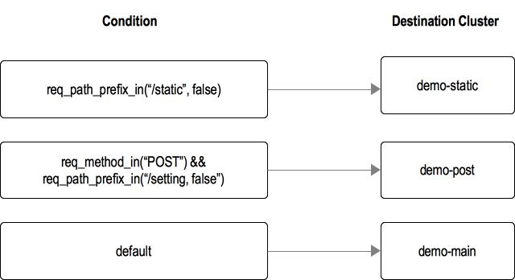

# BFE的路由转发机制

## 概述

在BFE的转发过程中，在确定请求所属的租户后，要根据HTTP报头的内容，进一步确定处理该请求的目标集群。在BFE内对每个租户维护一张独立的“转发表”。对于每个属于该租户的请求，通过查询转发表，获得目标集群。


## 转发表

转发表由多条“转发规则”组成。在查询时，对多条转发规则顺序查找；只要命中任何一条转发规则，就会结束退出。其中最后一条规则为“默认规则（Default）”。在所有转发规则都没有命中的时候，执行默认规则。

每条转发规则包括两部分：匹配条件，目标集群。其中匹配条件使用BFE自研的“条件表达式“（Condition Expression）来表述。


下图展示了一个转发表的例子。

在这个例子中，包含以下3种服务集群：

+ 静态集群(demo-static)：服务静态流量
+ post集群(demo-post)：服务post流量
+ main集群(demo-main)：服务其他流量

期望的转发逻辑如下：

+ 对于path以"/static"为前缀的，都发往demo-static集群
+ 请求方法为"POST"、且path以"/setting"为前缀的，都发往demo-post
+ 其它请求，都发往demo-main

在转发表中，使用条件表达式来描述以上转发条件。



## 条件表达式

条件表达式是BFE路由转发的核心机制，下面对条件表达式的设计思想和机制进行介绍。

更多关于条件表达式的细节，可以查看BFE开源官网中[关于条件表达式的说明](https://github.com/bfenetworks/bfe/tree/develop/docs/zh_cn/condition)

### 设计思想

在使用Go语言重构BFE转发引擎之前，BFE使用正则表达式来描述转发的条件。在实践中，发现正则表达式存在以下2个严重问题：

+ 配置难以维护

  正则表达式存在严重的可读性问题。用正则表达式编写的转发条件很难看懂，且易存在二义性。也经常会发现一个人编写的分流条件，其他人很难接手继续维护。

+ 性能存在隐患

  对于编写不当的正则表达式，可能在特定的流量特征下出现严重的性能退化。在线上曾经发生过这样的情况：原本每秒可以处理几千请求的服务，由于增加了一个正则表达式描述，性能下降到每秒只能处理几十个请求。

针对正则表达式存在的问题，在重构BFE转发引擎时设计了条件表达式。条件表达式的设计中有以下思想：

+ 在表述中明确指定所使用的HTTP请求字段，提升可读性

  例如，从req_path_prefix_in()这样的名字，可以立刻看出是针对请求中的path部分进行前缀匹配；从req_method_in()可以看出是针对请求的method字段进行匹配。

+ 控制计算的复杂度，降低性能退化的风险

  条件表达式主要使用精确匹配、前缀匹配、后缀匹配等计算方式。这些计算方式的计算复杂度都较低。

### 基本概念

#### 条件原语（Condition Primitive）

- 条件原语是基本的内置条件判断单元，执行某种比较来判断是否满足条件

``` go
// 如果请求host是"bfe-networks.com"或"bfe-networks.org", 返回true
req_host_in("bfe-networks.com|bfe-networks.org") 
```

+ 条件原语是判断的最小单元。按照请求、响应、会话、系统等几个分类，建立了几十个条件原语。也可以根据需求，增加新的条件原语。

#### 条件表达式（Condition Expression）

- 条件表达式是多个条件原语与操作符(例如与、或、非)的组合

```go
// 如果请求域名是"bfe-networks.com"且请求方法是"GET", 返回true
req_host_in("bfe-networks.com") && req_method_in("GET") 
```

#### 条件变量（Condition Variable）

- 可以将条件表达式赋值给一个变量，这个变量被定义为条件变量

```go
// 将条件表达式赋值给变量bfe_host
bfe_host = req_host_in("bfe-networks.com") 
```

#### 高级条件表达式（Advanced Condition Expression）

- 高级条件表达式是多个条件原语和条件变量与操作符(例如与、或、非)的组合

- 在高级条件表达式中，条件变量以$前缀作为标示

```go
// 如果变量bfe_host为true且请求方法是"GET"，返回true
$bfe_host && req_method_in("GET") 
```

+ 条件变量和高级条件表达式的引入，是为了便于条件表达式逻辑的复用。

### 语法

#### 条件原语的语法

条件原语的形式如下：

```go
func_name(params)
```

- **func_name**是条件原语名称
- **params**是条件原语的参数，可能是0个或多个
- 返回值类型是**bool**

#### 条件表达式的语法

条件表达式(CE: Condition Expression)的语法定义如下：

```
CE = CE && CE
   | CE || CE
   | ( CE )
   | ! CE
   | ConditionPrimitive
```

#### 高级条件表达式的语法

高级条件表达式(ACE: Advanced Condition Expression)的语法定义如下：

```
ACE = ACE && ACE
    | ACE || ACE
    | ( ACE )
    | ! ACE
    | ConditionPrimitive
    | ConditionVariable
```

#### 操作符优先级

操作符的优先级和结合律与C语言中类似。下表列出了所有操作符的优先级及结合律。操作符从上至下按操作符优先级降序排列。

| 优先级 | 操作符 | 含义   | 结合律   |
| ------ | ------ | ------ | -------- |
| 1      | ()     | 括号   | 从左至右 |
| 2      | !      | 逻辑非 | 从右至左 |
| 3      | &&     | 逻辑与 | 从左至右 |
| 4      | \|\|   | 逻辑或 | 从左至右 |

### 条件原语所匹配的内容

条件原语可以对请求、响应、会话及请求上下文中的内容进行匹配。每个条件原语都会对某种内容进行有针对性的精确匹配。这样的方式提升了转发配置的描述准确性，也提升了可读性和可维护性。

条件原语匹配的内容包括：

+ **cip**：Client IP，客户端地址
  + 如：req_cip_range(start_ip, end_ip)
+ **vip**：Virtual IP，服务端虚拟IP地址
  + 如：req_vip_in(vip_list)
+ **cookie**：HTTP头部所携带的cookie
  + 对一个cookie，包含key和value两部分
  + 如：req_cookie_key_in(key_list)，req_cookie_value_in(key, value_list, case_insensitive)
+ **header**：准确的说，应该是HTTP头部字段（HTTP header field）
  + 对一个HTTP头部字段，包含key和value两部分
  + 如：req_header_key_in(key_list)，req_header_value_in(header_name, value_list, case_insensitive)
+ **method**：HTTP方法
  + HTTP方法包括GET、POST、PUT、DELETE等
  + 如：req_method_in(method_list)
+ **URL**：统一资源定位符
  + 如：req_url_regmatch(reg_exp)

对于URL，其详细格式为：

```
scheme:[//authority]path[?query][#fragment]
```

其中，authority的格式为：

```
[userinfo@]host[:port]
```

针对URL，可以进一步匹配其中的内容：

+ **host**：主机名
  + 如：req_host_in(host_list)
+ **port**：端口
  + 如：req_port_in(port_list)
+ **path**：路径
  + 如：req_path_in(path_list, case_insensitive)
+ **query**：查询字符串
  + 对一个查询字符串，包含key和value两部分
  + 如：req_query_key_in(key_list)，req_query_value_in(key, value_list, case_insensitive)

### 条件原语名称的规范

目前在BFE开源项目中，已经包括40多种条件原语。条件原语的名称会遵循一定的规范，以便于分类和阅读。

BFE开源项目所支持条件原语的列表，可以查看[BFE开源官网](https://github.com/bfenetworks/bfe/blob/develop/docs/zh_cn/condition/condition_primitive_index.md)

#### 条件原语名称前缀

- 针对Request的原语，会以"**req_**"开头
  - 如：req_host_in()

- 针对Response的原语，会以"**res_**"开头
  - 如：res_code_in()

- 针对Session的原语，会以"**ses_**"开头
  - 如：ses_vip_in()

- 针对系统原语，会以"**bfe_**" 开头
  - 如：bfe_time_range()

#### 条件原语中比较的动作名称

- **match**：精确匹配
  - 如：req_tag_match()
- **in**：值是否在某个集合中
  - 如：req_host_in()
- **prefix_in**：值的前缀是否在某个集合中
  - 如：req_path_prefix_in()
- **suffix_in**：值的后缀是否在某个集合中
  - 如：req_path_suffix_in()
- **key_exist**：是否存在指定的key
  - 如：req_query_key_exist()
- **value_in**：对给定的key，其value是否落在某个集合中
  - 如：req_header_value_in()
- **value_prefix_in**：对给定的key，其value的前缀是否在某个集合中
  - 如：req_header_value_prefix_in()
- **value_suffix_in**：对给定的key，其value的后缀是否在某个集合中
  - 如：req_header_value_suffix_in()
- **range**：范围匹配
  - 如：req_cip_range()
- **regmatch**：正则匹配
  - 如：req_url_regmatch()
  - 注：这类条件原语不合理使用将明显影响性能，谨慎使用
- **contain**: 字符串包含匹配
  - 如：req_cookie_value_contain()